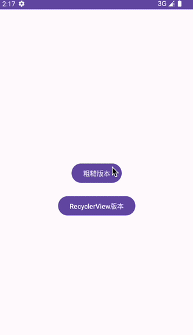
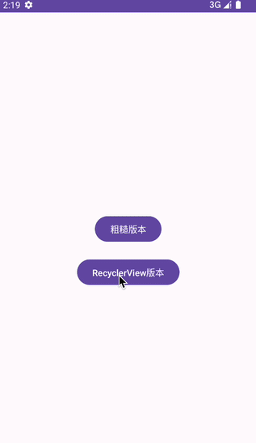

# FlingScrollView
Android自定义 View惯性滚动效果（不使用Scroller）

## 前言：
* 看了网上很多惯性滚动方案，都是通过Scroller 配合 computeScroll实现的，但在实际开发中可能有一些场景不合适，比如协调布局，内部子View有特别复杂的联动效果，需要通过偏移来配合。

* 实现原理很简单：使用VelocityTracker（速度跟踪器），拿到初始速度**逐步递减，直至停止**的过程。
  我写了两个版本：**粗糙版本** 和 **RecyclerView版本**，区别在于，前者逐步递减过程是我自己算的，后者是我将RecyclerView里面惯性运动相关的代码，扒了出来进行封装，**推荐使用后者**。
<br/>

## 1. 粗糙版本


* FlingTask(核心类)

```
/**
 * 惯性任务
 */
public class FlingTask implements Runnable {

    private Handler mHandler;
    private int velocityY = 0;
    private int originalVelocityY = 0;
    private FlingTaskCallback flingTaskCallback;

    public FlingTask(int velocityY, Handler handler, FlingTaskCallback callback) {
        this.velocityY = velocityY;
        this.mHandler = handler;
        this.originalVelocityY = velocityY;
        this.flingTaskCallback = callback;
    }

    boolean initSlide = false; // 初始化滑动
    int average = 0; // 平均速度
    int tempAverage = 1;
    boolean startSmooth = false; // 开始递减速度平滑处理
    int sameCount = 0; // 值相同次数

    // 这里控制平均每段滑动的速度
    private int getAverageDistance(int velocityY) {
        int t = velocityY;
        if (t < 470) {
            t /= 21;
        }
        // divide by zero
        if (t == 0) return 0;
        int v = Math.abs(velocityY / t);
        if (v < 21) {
            t /= 21;
            if (t > 20) {
                t /= 5;
            }
        }
        return t;
    }

    @Override
    public void run() {
        // 速度完全消耗完才结束任务，和view滚动结束不冲突
        // 这个判断是为了扩展，将没消耗完的速度，转给指定的滚动view
        // if (velocityY > 0) {

        // 只要view滚动结束，立刻结束任务
        if (tempAverage > 0 && velocityY > 0) {

            if (!initSlide) {
                average = getAverageDistance(velocityY);
                initSlide = true;
            }

            float progress = (float) velocityY / originalVelocityY;
            float newProgress = 0f;
            if (average > 300) {
                newProgress = getInterpolation(progress);
            } else {
                newProgress = getInterpolation02(progress);
            }

            int prTemp = tempAverage;
            if (!startSmooth) tempAverage = (int) (average * newProgress);

            // 递减速度平滑处理
            if (prTemp == tempAverage) {
                sameCount++;
                if (sameCount > 1 && tempAverage > 0) { // 这个值越大，最后衰减停止时越生硬，0 - 30
                    tempAverage--;
                    sameCount = 0;
                    startSmooth = true;
                }
            }

            flingTaskCallback.executeTask(tempAverage);

            velocityY -= tempAverage;

            // 这里这样写是为了扩展，将没消耗完的速度，转给其他滚动列表
            // 判断语句需要改成 if (velocityY > 0)
            if (tempAverage == 0) { // view滚动停止时
                // 如果速度没有消耗完，继续消耗
                velocityY -= average;
            }
            // Log.d("TAG", "tempAverage：" + tempAverage + " --- velocityY：" + velocityY + " --- originalVelocityY：" + originalVelocityY);

            mHandler.post(this);
        } else {
            flingTaskCallback.stopTask();
            stopTask();
        }
    }

    public void stopTask() {
        mHandler.removeCallbacks(this);
        initSlide = false;
        startSmooth = false;
    }


    // 从加速度到逐步衰减（AccelerateDecelerateInterpolator插值器 核心源码）
    public float getInterpolation(float input) {
        return (float) (Math.cos((input + 1) * Math.PI) / 2.0f) + 0.5f;
    }

    // 速度逐步衰减（DecelerateInterpolator插值器 核心源码）
    public float getInterpolation02(float input) {
        return (float) (1.0f - (1.0f - input) * (1.0f - input));
    }

    public interface FlingTaskCallback {
        void executeTask(int dy);

        void stopTask();
    }
}
```
<br/>

## 2. RecyclerView版本


* ComputeFling(核心类)

```
/**
 * 计算出当前惯性，产生的总距离 和 持续时间
 * 再配合ValueAnimator使用，实现惯性效果
 */
public class ComputeFling {

    private static final float INFLEXION = 0.35f; // Tension lines cross at (INFLEXION, 1)
    private static final int NB_SAMPLES = 100;

    // 惯施加在滚动和甩动上的摩擦量。
    // 返回值：表示摩擦系数的标量无量纲值。
    // Fling friction
    private float mFlingFriction = ViewConfiguration.getScrollFriction();

    // A context-specific coefficient adjusted to physical values.
    private float mPhysicalCoeff;

    // 减速率
    private float DECELERATION_RATE = (float) (Math.log(0.78) / Math.log(0.9));

    // Distance to travel along spline animation
    private int mSplineDistance; // 惯性产生的总距离

    // Duration to complete spline component of animation
    private int mSplineDuration; // 惯性持续时间

    // Initial velocity
    private int mVelocity; // 速度

    // Current velocity
    private float mCurrVelocity;

    // Animation starting time, in system milliseconds
    private long mStartTime;

    // Animation duration, in milliseconds
    private int mDuration;

    public ComputeFling(Context context) {
        // 像素密度
        final float ppi = context.getResources().getDisplayMetrics().density * 160.0f;
        mPhysicalCoeff = SensorManager.GRAVITY_EARTH // g (m/s^2) 重力加速度单位：m/s²；重力加速度是一个物体受重力作用的情况下所具有的加速度，也叫自由落体加速度，用g表示。
                * 39.37f // inch/meter
                * ppi
                * 0.84f; // look and feel tuning
    }

    public FlingTaskInfo compute(int start, int velocity, int min, int max) {
        mCurrVelocity = mVelocity = velocity;
        mDuration = mSplineDuration = 0;
        mStartTime = AnimationUtils.currentAnimationTimeMillis();

        double totalDistance = 0.0;

        if (velocity != 0) {
            mDuration = mSplineDuration = getSplineFlingDuration(velocity);
            totalDistance = getSplineFlingDistance(velocity);
            return new FlingTaskInfo(mDuration, totalDistance);
        }
        return new FlingTaskInfo(0, 0);
    }

    private double getSplineDeceleration(int velocity) {
        // Math.abs：获取绝对值
        // Math.log：计算对数
        return Math.log(INFLEXION * Math.abs(velocity) / (mFlingFriction * mPhysicalCoeff));
    }

    /**
     * @param velocity 速度
     * @return 当前惯性持续时间
     */
    private int getSplineFlingDuration(int velocity) {
        final double l = getSplineDeceleration(velocity);
        final double decelMinusOne = DECELERATION_RATE - 1.0;
        // 计算指数函数
        return (int) (1000.0 * Math.exp(l / decelMinusOne));
    }

    /**
     * @param velocity 速度
     * @return 当前惯性产生的总距离
     */
    private double getSplineFlingDistance(int velocity) {
        final double l = getSplineDeceleration(velocity);
        final double decelMinusOne = DECELERATION_RATE - 1.0;
        return mFlingFriction * mPhysicalCoeff * Math.exp(DECELERATION_RATE / decelMinusOne * l);
    }

    /**
     * 惯性参数 实体
     */
    public class FlingTaskInfo {
        private int mDuration;  // 本次惯性滚动 持续的时间
        private double totalDistance; // 本次惯性滚动，总共滚动的距离

        public FlingTaskInfo(int mDuration, double totalDistance) {
            this.mDuration = mDuration;
            this.totalDistance = totalDistance;
        }

        public int getmDuration() {
            return mDuration;
        }

        public double getTotalDistance() {
            return totalDistance;
        }

        @Override
        public String toString() {
            return "FlingTaskInfo{" +
                    "mDuration=" + mDuration +
                    ", totalDistance=" + totalDistance +
                    '}';
        }
    }

    /**
     * 递减插值器
     */
    public static final Interpolator sQuinticInterpolator = new Interpolator() {
        @Override
        public float getInterpolation(float t) {
            t -= 1.0f;
            return t * t * t * t * t + 1.0f;
        }
    };

}
```


